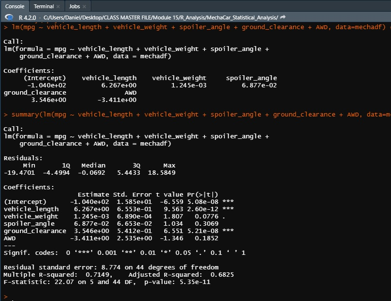
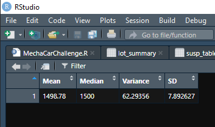
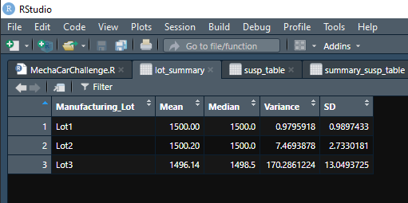
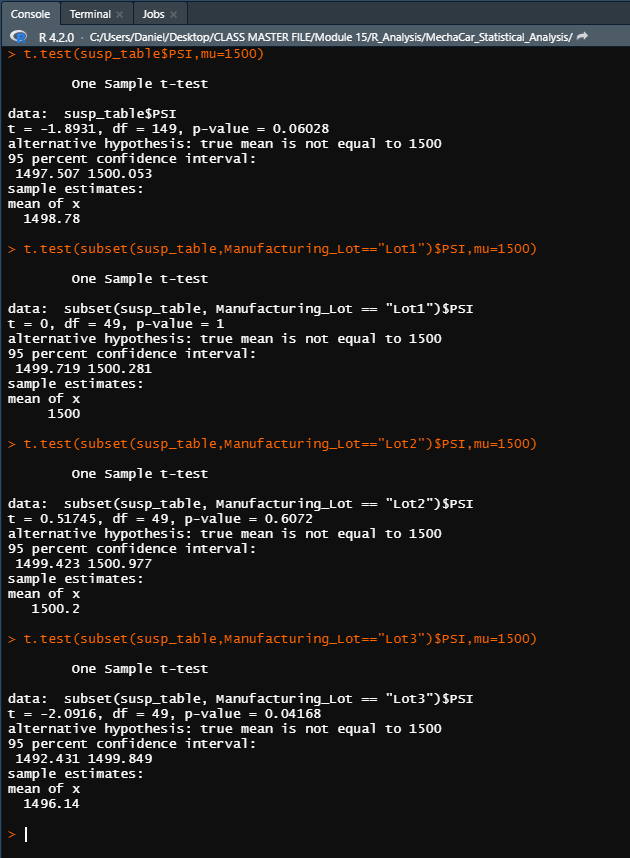

# MechaCar_Statistical_Analysis
## Linear Regression to Predict MPG
Which variables/coefficients provided a non-random amount of variance to the mpg values in the dataset?
* Vehicle Length: p-value = 2.6e-12
* Ground Clearance: p-value = 5.21e-8

Is the slope of the linear model considered to be zero? Why or why not?
- No, the p-value of the model is less than .05 making it low enough to reject the null hypothesis thusly giving the model slope.  

Does this linear model predict mpg of MechaCar prototypes effectively? Why or why not?
- The r2 value and the p-value of the model indicated below shows that the linear model does predict the mpg effectively.
 
 

## Summary Statistics on Suspension Coils
The design specifications for the MechaCar suspension coils dictate that the variance of the suspension coils must not exceed 100 pounds per square inch. Does the current manufacturing data meet this design specification for all manufacturing lots in total and each lot individually? Why or why not?

The overall variance is 62.3 psi which falls within manufacturer specs. However, the variance of lot 3 is the main contribution to the variance by far with 170 psi. 

## T-Tests on Suspension Coils

Test 1: with p-value of .06 the population is statisitcally the same as 1500 psi. 
Lot 1: with p-value of 1 the population is statisitcally similar to 1500 psi.
Lot 2: with p-value of .6 the population is statisitcally similar to 1500 psi.
Lot 3: with p-value of .04 the population is **not** statisitcally similar 1500 psi.
## Study Design: MechaCar vs Competition
What metric or metrics are you going to test?

The main categories of comparison between MechaCar and the competition should be customer focused:
* Dealership pricing
* Number of Features/Functionalities
* MPG Comparison
* Mech. Spec. Comparison

What is the null hypothesis or alternative hypothesis?

* MechaCar does not differ from the competition in these categories in a statistically significant way. 

What statistical test(s)would you use to test the hypothesis? And why?

* Perform linear regression on the following data, conducting t-tests wherever necessary to prove statistical significance:
- Dealership pricing across the competing market.
- Comparision of data on the mechanical specifications/quality of life features on competing models. 
- Compare and contrast MPG data from competing models.
