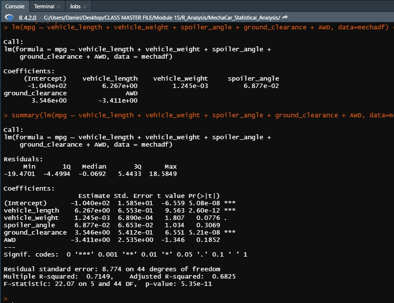
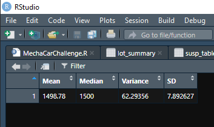
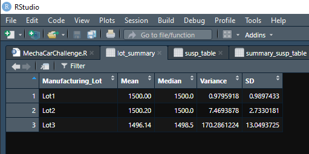
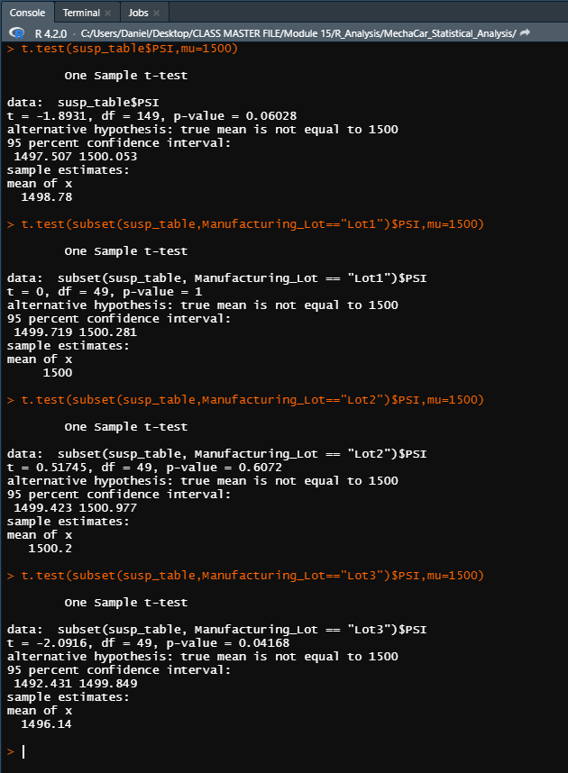

# **MechaCar_Statistical_Analysis**
### **This project demonstrates skills in Advanced Statistics and Predictive Machine Learning: Multiple Linear Regression.**

All coding for this repo is done in Rstudio (R) 
* **
## **Use Case**:
*"Autos-R-Us is an automotive manufacturer that has produced its newest prototype, the "MechaCar". The MechaCar is suffering from production troubles that are blocking the manufacturing team’s progress. Autos-R-Us’ upper management has called for the review of production data to gather insights that may help the manufacturing team."*
  

## **Linear Regression to Predict MPG**
The dataset contains MPG test results for 50 prototype MechaCars. These prototypes underwent production using multiple design specifications, resulting in the intended variance of attributes across the population. Within the scope of the Predictive Machine Learning algorithm deployed in this exercise, the specs of each prototype (ex: vehicle length, vehicle weight, spoiler angle, drivetrain, and ground clearance) get separated as features (variables) with the intent of finding the answers to the following questions:

**Which variables/coefficients provided a non-random amount of variance to the mpg values in the dataset?** (see fig. 1)

The following variables returned a p-value less than .05, indicative of a non-random amount of variance:
* **Vehicle Length**: p-value = 2.6e-12
* **Ground Clearance**: p-value = 5.21e-8

**Is the slope of the linear model considered to be zero? Why or why not?** *-No*
- The p-value of the model is significantly less than .05 (5.35e-11), low enough to reject the null hypothesis; confirming that the linear model has a slope.  

**Does this linear model predict mpg of MechaCar prototypes effectively? Why or why not?** *-Yes*
- The high r2 value and the statistically significant p-value of the model (indicated below in fig. 1) confirm the linear model's effectiveness in identifying causes of variance within the model.
 
 

above: fig. 1
* **
 
 

## **Summary Statistics on Suspension Coils**
The design specifications for MechaCar suspension coils dictate that pressure variance between suspension coils must not exceed 100 pounds per square inch. Does the current manufacturing data meet this design specification for all manufacturing lots in total and each lot individually? Why or why not?

**Average variance of the population** is 62.3 psi (fig. 2), which falls within manufacturer specs.  
**Manufacturing lot 1** has the lowest average at 0.98 psi (fig. 3). 
**Manufacturing lot 2** has an acceptable value of 7.47 psi (fig. 3). 
**Manufacturing lot 3** has a variance value of 170.29 psi (fig. 3). Lot 3 accounts for a majority of the rise in average variance value and is considered out of specification by the manufacturer.
 
 

above: fig. 2 
 
 

above: fig. 3
 
 
 

* **
## T-Tests on Suspension Coils
Perform t-tests to determine if the manufacturing lots (both **individually** and **as a whole**) are statistically different from the population mean of 1,500 pounds per square inch.

above: fig. 4

**Test 1**: with p-value of .06 **the population average is statistically similar to 1500 psi**.  
**Lot 1**: with p-value of 1 **the Lot 1 average is statistically similar to 1500 psi**. 
**Lot 2**: with p-value of .6 **the Lot 2 average is statistically similar to 1500 psi**. 
**Lot 3**: with p-value of .04 the population is **not** statisitcally similar 1500 psi. 
 

* **
## Study Design: MechaCar vs Competition
After the identification of issues limiting the manufacturing team's progress (and the assumed rectification of these issues) it is assumed that the manufacturuing process able to enter the consumer production stage without any further complication. In anticipation of this, an outline has been produced to develop a market comparison "control" benchmark. The benchmark acts as the control or initial data point for all subsequent comparisons between the MechaCar and its competitors.

**The main categories of comparison:**
* Dealership pricing
* Number of Features/Functionalities
* MPG Comparison
* Mech. Spec. Comparison

**What is the null hypothesis or alternative hypothesis?**
 

 *"MechaCar does not outpreform the competition in any respect that would result in a positive impact on customer preception."*

**What statistical test(s)would you use to test the hypothesis? And why?**

1.) Perform a mutltiple linear regression on the following data: 

    - Dataset 1:
        - Dealership pricing across the competing market
        - Number of "quality of life"/technology options on competing models
    - Dataset 2:
        - Detailed spec comparison
        - MPG data from competing models
    - Dependent dataset:
        - Historic sales data for the previous x years
2.)  Run t-tests to determine the statistical significance of:

    - Dataset 1:
        - Any correlative relationships between number of features and dealer (end user) pricing.
        - Which features (variables) tend to result in an increase in sale price historically. 
        - Which features/combinations of features exist on the best selling models around the target price of the MechaCar.
    - Dataset 2:
        - Which specification features (variables) tend to have a statistically significant impact on sale price. 
        - Which specifications (or combination) are statistical predictors of sales data (if any).
        - Which features tend to have a statistically significant impact on sale pricing.
3.) Use the statistically significant relationships found in step two to draw comparisons between the MechaCar and its competition. 
